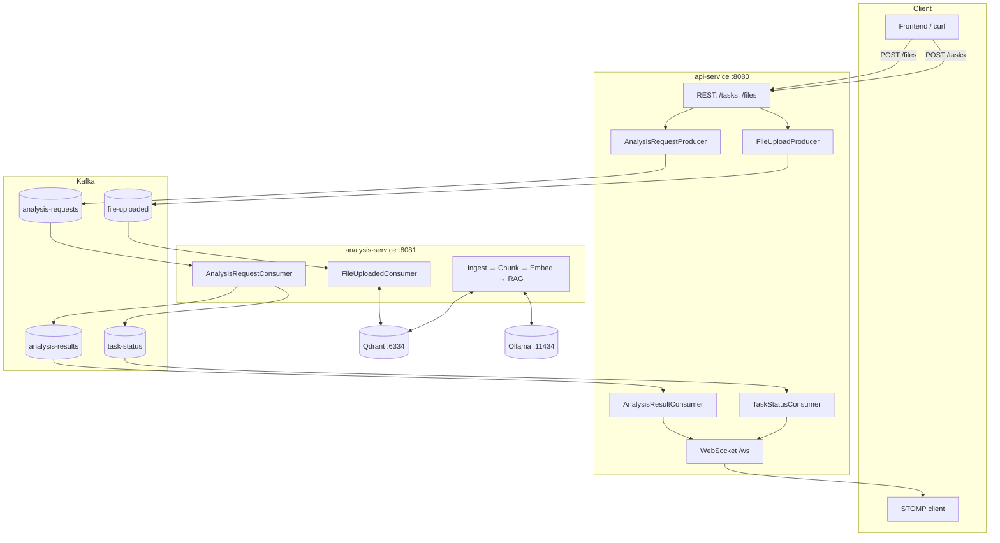
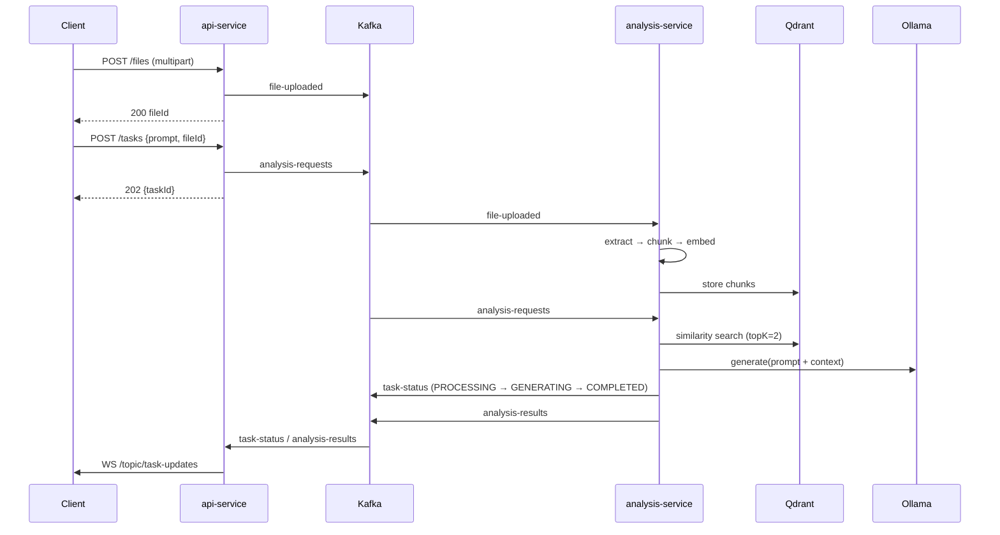

# Event-Driven AI Platform

Upload documents, ask questions, get grounded answers — over an event-driven
pipeline (Spring Boot + Kafka + Qdrant + Ollama) with live progress streamed
over WebSocket.



## Request lifecycle



A task **without** `fileId` skips the document path and goes straight to
`Ollama.generate(prompt)`. A task **with** `fileId` waits until that
document is ingested (`DocumentStateManager`), then runs retrieval-augmented
generation.

## Repo layout

| Path | What it is | Details |
|---|---|---|
| `api service/` | REST + WebSocket edge service (`:8080`) | [README](<api service/README.md>) |
| `analysis service/` | Async workers: ingestion + RAG (`:8081`) | [README](<analysis service/README.md>) |
| `event-contracts/` | Shared Kafka event schemas (v`1.0-SNAPSHOT`) | [README](event-contracts/README.md) |
| `infrastructure/` | Docker Compose stack + Prometheus config | [README](infrastructure/README.md) |
| `k8s/` | Kubernetes manifests (namespace `event-platform`) | See [Deploy to Kubernetes](#deploy-to-kubernetes) |
| `stomp-test/index.html` | Manual WebSocket test page | Open after `docker compose up` |

## Prerequisites

* **Docker Desktop** (or Docker Engine 24+ with Compose v2) — ~4 GB free RAM.
* **Ollama on the host** with the models pulled (the stack calls your host's
  Ollama, it does not run one in Docker):
  ```bash
  ollama pull gpt-oss:120b-cloud
  ollama pull nomic-embed-text
  ```
* Free ports: `8080`, `8081`, `9090`, `9092`, `3000`, `6333`, `6334`.
* Java 21 + Maven — only for local (non-Docker) runs.

## Run it with Docker (recommended)

```bash
# 1. Clone
git clone https://github.com/lakshyasharma2612-debug/Event-driven-ai-platform.git
cd Event-driven-ai-platform

# 2. Start Ollama so containers can reach it.
#    It MUST listen on all interfaces, not just localhost:
OLLAMA_HOST=0.0.0.0 ollama serve

# 3. Build + start the whole stack (first build takes a few minutes)
docker compose -f infrastructure/docker-compose.yml up --build -d

# 4. Check health
curl localhost:8080/actuator/health   # api-service
curl localhost:8081/actuator/health   # analysis-service
```

> On Linux, `host.docker.internal` is mapped via `extra_hosts` (already in
> the compose file). On Docker Desktop it works out of the box.

### Use it

```bash
# Upload a document -> returns a fileId
curl -F "file=@./sportif.pdf" localhost:8080/files

# Ask a question grounded in that document -> returns {"taskId":"..."}
curl -X POST localhost:8080/tasks \
  -H "Content-Type: application/json" \
  -d '{"prompt":"Summarise the key clauses","fileId":"<fileId>"}'

# ...or ask without any document
curl -X POST localhost:8080/tasks \
  -H "Content-Type: application/json" \
  -d '{"prompt":"What is the capital of France?"}'
```

Watch live progress: open `stomp-test/index.html` in a browser, click
**Connect**, and observe `/topic/task-updates` as the task moves
`QUEUED → PROCESSING → RETRIEVING_CONTEXT → GENERATING → COMPLETED`.

| UI | URL |
|---|---|
| Grafana dashboards | `localhost:3000` (default `admin/admin` — change it) |
| Prometheus targets | `localhost:9090` |

Stop everything: `docker compose -f infrastructure/docker-compose.yml down`
(add `-v` only if you intend to **delete** Qdrant vectors, uploads, and
metrics).

## Kafka topics

| Topic | Producer → Consumer | Payload |
|---|---|---|
| `analysis-requests` | api → analysis | `AnalysisRequested` |
| `file-uploaded` | api → analysis | `FileUploaded` (+ `.DLT` on repeated failure) |
| `task-status` | analysis → api | `TaskStatusChanged` |
| `analysis-results` | analysis → api | `AnalysisResult` |

## Deploy to Kubernetes

Images are tagged to match the manifests (`event-platform-api:latest`,
`event-platform-analysis:1.0.0`), so a compose build feeds `kubectl` directly:

```bash
docker compose -f infrastructure/docker-compose.yml build
kubectl apply -f k8s/namespace.yaml
kubectl apply -f k8s/
kubectl -n event-platform get pods
```

Notes:

* The `uploads-pv` / `qdrant-pv` `hostPath`s point at Docker Desktop's
  Windows mount layout (`/run/desktop/mnt/host/...`). On a real cluster,
  replace them with a `StorageClass` + PVCs.
* The API has no `Ingress` — add one with TLS termination when exposing it,
  and keep Kafka/Qdrant/Prometheus as `ClusterIP`.
* See [infrastructure/README](infrastructure/README.md) for the full
  service/port/volume map.

## Troubleshooting

| Symptom | Cause / fix |
|---|---|
| `api` logs `kafka:29092` DNS failure on host `mvn` runs | `kafka` resolves only inside Docker. For host runs set `KAFKA_BOOTSTRAP_SERVERS=localhost:9092`. |
| Client stuck after bootstrap to `kafka:29092` | Broker still advertises old `localhost:9092` listener — rebuild/restart the `kafka` container. |
| `Connection refused` to Ollama from analysis | Ollama bound to `127.0.0.1`. Restart with `OLLAMA_HOST=0.0.0.0 ollama serve`. |
| First question is very slow | Embedding/chat models load on first use; subsequent calls are fast. |
| Fresh `up` lost my uploaded files | Expected — `uploads_data` starts empty. `docker cp` files in if needed. |
| `PAYLOAD_TOO_LARGE` deprecation warning on build | Fixed — uses `HttpStatus.CONTENT_TOO_LARGE`. |

## Security status (read before exposing publicly)

Unauthenticated REST + open WebSocket origins, plaintext Kafka, keyless
Qdrant, `admin/admin` Grafana. Safe on `localhost`; see the deployment
hardening checklist in [infrastructure/README](infrastructure/README.md#security-checklist)
before putting this on a network.
