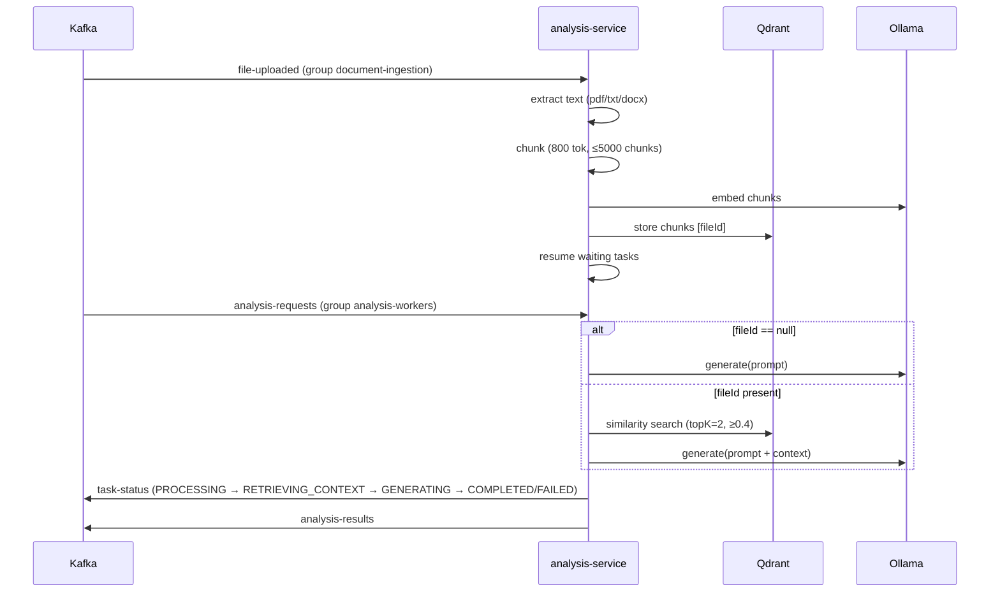

# analysis-service (`:8081`)

Async worker: ingests uploaded documents into Qdrant and answers tasks with
retrieval-augmented generation via Ollama. No REST surface — Kafka in, Kafka out.



## Kafka wiring

| Direction | Topic | Group | Handler |
|---|---|---|---|
| consume | `analysis-requests` | `analysis-workers` | `event/AnalysisRequestConsumer.java` |
| consume | `file-uploaded` | `document-ingestion` | `event/FileUploadedConsumer.java` |
| consume | `file-uploaded.DLT` | `document-ingestion-dlt` | `event/FileUploadedDltConsumer.java` (fails waiting tasks) |
| produce | `task-status` | — | `event/TaskStatusProducer.java`, key = `taskId` |
| produce | `analysis-results` | — | `event/AnalysisResultProducer.java`, key = `taskId` |

**Ordering guarantee that matters:** a task referencing a not-yet-ingested
`fileId` is parked in `DocumentStateManager` (in-memory + Qdrant-readiness
fallback) and resumed when `file-uploaded` is processed.

**Failure policy** (`config/KafkaErrorHandlerConfig.java`): `FixedBackOff`
`2000ms × 2`, then publish to `<topic>.DLT`. For `analysis-requests` the
recoverer additionally emits `FAILED` status + result so clients are never
left hanging.

## Pipeline stages (`service/`)

1. `DocumentIngestionService` + `extractor/` — text extraction per content type.
2. `DocumentChunkingService` — `TokenTextSplitter` into overlapping chunks
   tagged `{fileId, chunkIndex}`.
3. `DocumentVectorStoreService` — embed + store in Qdrant collection
   `document_chunks`; filtered similarity search per `fileId`.
4. `AnalysisTaskProcessor` — status fan-out, Ollama calls, Micrometer timers
   (`task_processing_duration`) and counters.

## Configuration

| Env var | Default | Purpose |
|---|---|---|
| `KAFKA_BOOTSTRAP_SERVERS` | `kafka:29092` | Kafka bootstrap |
| `QDRANT_HOST` / `QDRANT_PORT` | `qdrant` / `6334` | Qdrant gRPC endpoint |
| `OLLAMA_BASE_URL` | `http://host.docker.internal:11434` | Ollama server (models below) |
| `APP_UPLOAD_DIR` | `/app/uploads` | Shared volume with api-service |
| `JAVA_OPTS` | `-XX:MaxRAMPercentage=75.0` (compose) | Heap sizing inside the 1 GB container |

Baked-in model/tuning (edit `src/main/resources/application.properties` to change):

| Key | Value |
|---|---|
| `spring.ai.ollama.chat.options.model` | `gpt-oss:120b-cloud` |
| `spring.ai.ollama.embedding.model` | `nomic-embed-text` |
| `app.document.chunk-size / min-chunk-size-chars / min-chunk-length-to-embed / max-num-chunks` | `800 / 350 / 10 / 5000` |
| `app.vector-search.top-k / similarity-threshold` | `2 / 0.4` |
| `spring.ai.retry.max-attempts` | `1` |

Actuator: `/actuator/health`, `/actuator/prometheus`.

## Run locally (without Docker)

Needs Kafka, Qdrant, and Ollama (with both models pulled) reachable, then:

```bash
cd "analysis service"
KAFKA_BOOTSTRAP_SERVERS=localhost:9092 QDRANT_HOST=localhost \
OLLAMA_BASE_URL=http://localhost:11434 APP_UPLOAD_DIR=../uploads \
  mvn spring-boot:run
```

Image (from repo root — multi-stage build compiles `event-contracts` first):

```bash
docker build -f "analysis service/Dockerfile" -t event-platform-analysis:1.0.0 .
```

> First generation after startup is slow (models load on first use).
> `DocumentStateManager` is in-memory: restarting loses parked tasks unless
> Qdrant already holds the document (readiness fallback covers this).
