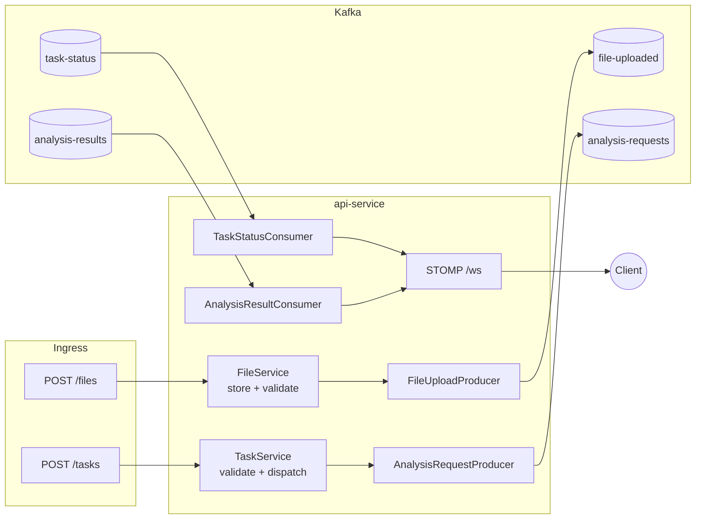

# api-service (`:8080`)

Edge service: REST intake for files/tasks, Kafka producer of work events,
Kafka consumer of progress, WebSocket broadcaster of live updates to clients.



## Endpoints

| Method & path | Body | Success | Errors |
|---|---|---|---|
| `POST /files` | `multipart/form-data`, field `file` (≤ 10 MB) | `200` plain `fileId` (UUID) | `400` empty file · `413` too large · `500` I/O failure |
| `POST /tasks` | JSON `{prompt, fileId?}` | `202` `{taskId}` | `400` blank prompt / prompt > 5000 chars / unknown `fileId` |

Validation (`dto/CreateTaskRequest.java`): `prompt` is `@NotBlank @Size(max=5000)`,
`fileId` must be a UUID when present; `TaskService` additionally rejects
unknown `fileId`s (`400 Invalid file ID`). Error shape is always
`{"error": "..."}` via `exception/GlobalExceptionHandler.java`.

```bash
curl -F "file=@doc.pdf" localhost:8080/files
curl -X POST localhost:8080/tasks -H "Content-Type: application/json" \
  -d '{"prompt":"Summarise this","fileId":"<fileId>"}'
```

## WebSocket contract

* Connect: `ws://<host>:8080/ws` (STOMP; `stomp-test/index.html` is a manual client).
* Subscribe: `/topic/task-updates`. Frames are the raw events:
  `TaskStatusChanged {taskId, status, timestamp}` and
  `AnalysisResult {taskId, status, result, error, completedAt}`.

## Kafka wiring

| Direction | Topic | Group | Notes |
|---|---|---|---|
| produce | `analysis-requests` | — | key = `taskId` |
| produce | `file-uploaded` | — | key = `fileId` |
| consume | `analysis-results` | `api-results` | forwards to WS |
| consume | `task-status` | `api-status` | forwards to WS |

Topic names come from `config/KafkaTopics.java` (mirrored in analysis;
canonical home is `event-contracts`). Consumer deserialization is restricted
to `com.event.platform.events`; failures go to `<topic>.DLT` after
`2000ms × 2` retries (`config/KafkaErrorHandlerConfig.java`).

## Configuration

| Env var | Default | Purpose |
|---|---|---|
| `KAFKA_BOOTSTRAP_SERVERS` | `kafka:29092` | Kafka bootstrap (use `localhost:9092` for host `mvn` runs) |
| `APP_UPLOAD_DIR` | `/app/uploads` in containers | Where uploaded bytes land (shared volume with analysis) |
| `SERVER_PORT` | `8080` (implicit) | HTTP port |

Actuator: `/actuator/health`, `/actuator/prometheus` (scraped by Prometheus).

## Run locally (without Docker)

Kafka must be reachable, then:

```bash
cd "api service"
KAFKA_BOOTSTRAP_SERVERS=localhost:9092 APP_UPLOAD_DIR=../uploads \
  mvn spring-boot:run
```

Or build the image from the **repo root** (the Dockerfile's multi-stage build
compiles `event-contracts` first, so plain `docker build` inside this folder
will fail to resolve the snapshot dependency):

```bash
docker build -f "api service/Dockerfile" -t event-platform-api:latest .
```
