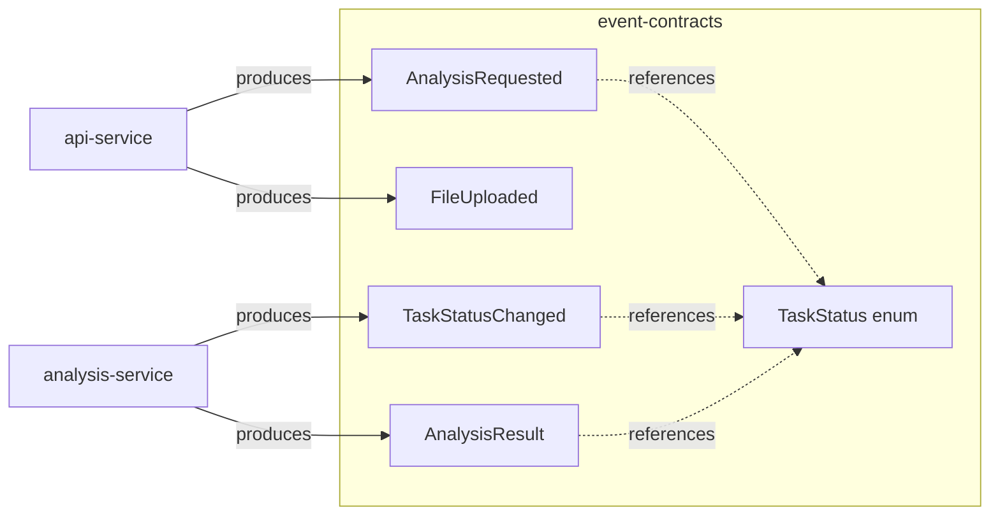

# event-contracts (v`1.0-SNAPSHOT`)

Single source of truth for every Kafka payload in the platform. Both services
depend on this module — no duplicated DTOs, no schema drift.



## Event catalog (`com.event.platform.events`)

| Class | Fields | Topic | Produced by |
|---|---|---|---|
| `AnalysisRequested` | `taskId, prompt, fileId, requestedAt` | `analysis-requests` | api |
| `FileUploaded` | `fileId, contentType, uploadedAt` | `file-uploaded` | api |
| `TaskStatusChanged` | `taskId, status, timestamp` | `task-status` | analysis |
| `AnalysisResult` | `taskId, status, result, error, completedAt` | `analysis-results` | analysis |

`TaskStatus` enum: `QUEUED → PROCESSING → RETRIEVING_CONTEXT → GENERATING → COMPLETED | FAILED`.

Topic name constants live in each service's `config/KafkaTopics.java`
(mirrored copies). DLT convention: `<topic>.DLT` (e.g. `file-uploaded.DLT`).
Jackson deserialization on both consumers is allow-listed to
`com.event.platform.events`.

## Evolve the schema safely

1. Only **additive** changes (new nullable fields, new enum values at the end).
   Never rename/remove fields or reorder the enum — old consumers in the other
   service will break.
2. Bump the version in `pom.xml` if the change isn't wire-compatible.
3. Rebuild + install so both services resolve it:
   ```bash
   cd event-contracts && mvn clean install -DskipTests
   ```
   (The Docker multi-stage builds do this automatically via
   `mvn -f event-contracts/pom.xml clean install`.)

Java 21, no runtime dependencies — Jackson-compatible POJOs with default
constructors for deserialization.
