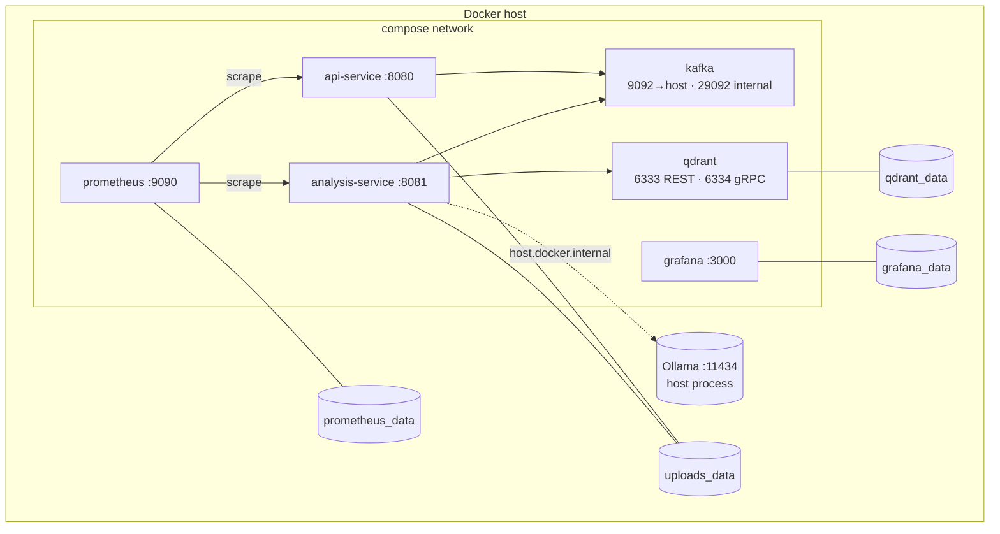

# infrastructure

Everything needed to run the platform: Docker Compose stack and Prometheus
scrape config. Kubernetes manifests live in `/k8s` (see main README).



## Services (`docker-compose.yml`)

| Service | Image | Host ports | Volumes | Health |
|---|---|---|---|---|
| `kafka` | `apache/kafka:4.0.1` | `9092` | — (ephemeral!) | `kafka-broker-api-versions.sh` |
| `qdrant` | `qdrant/qdrant:v1.19.1` | `6333`, `6334` | `qdrant_data:/qdrant/storage` | none (ordered start only) |
| `api-service` | built → `event-platform-api:latest` | `8080` | `uploads_data:/app/uploads` | via k8s probes only |
| `analysis-service` | built → `event-platform-analysis:1.0.0` | `8081` | `uploads_data:/app/uploads` | — |
| `prometheus` | `prom/prometheus:v3.8.1` | `9090` | `prometheus_data`, `./prometheus/prometheus.yml` | — |
| `grafana` | `grafana/grafana:12.1.1` | `3000` | `grafana_data` | — |

Kafka listeners: `INTERNAL://kafka:29092` (inter-container), `EXTERNAL://localhost:9092`
(host debugging). Apps use the internal one. Prometheus scrapes
`api-service:8080` and `analysis-service:8081` at `/actuator/prometheus`
(`prometheus/prometheus.yml`).

## Common commands (from repo root)

```bash
docker compose -f infrastructure/docker-compose.yml up --build -d
docker compose -f infrastructure/docker-compose.yml logs -f api-service analysis-service
docker compose -f infrastructure/docker-compose.yml down        # keep data
docker compose -f infrastructure/docker-compose.yml down -v    # DELETE data
```

## Security checklist

Read before exposing anything beyond `localhost`:

* [ ] Grafana `admin/admin` → set `GF_SECURITY_ADMIN_USER/PASSWORD` (via a
      gitignored `.env`, never committed).
* [ ] Unpublish or firewall `6333/6334` (keyless Qdrant) and `9092`
      (plaintext Kafka). Set `QDRANT__SERVICE__API_KEY` if Qdrant must be reachable.
* [ ] Add per-service `logging: {options: {max-size: "10m", max-file: "3"}}`
      — currently absent, logs grow unbounded.
* [ ] Add `HEALTHCHECK`s for api/analysis/qdrant (only kafka has one).
* [ ] `stop_grace_period: 60s` on analysis so SIGTERM doesn't kill
      in-flight generations at the default 10s.
* [ ] Back up `qdrant_data` (snapshots) + `uploads_data`; Kafka itself is
      ephemeral here (no broker volume) — acceptable for dev, not for prod.
* [ ] App-level auth/rate-limiting (see main README security status).
